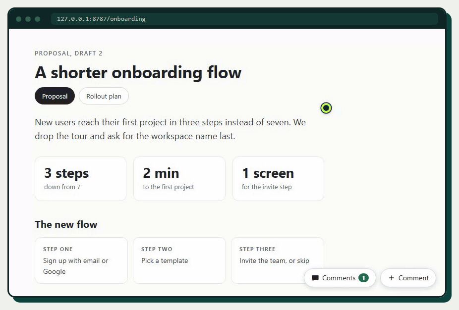
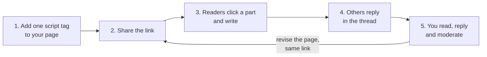
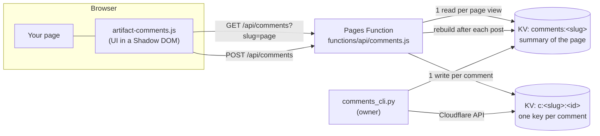

# artifact-comments

**Your AI-made pages can now take comments, like Figma. One script tag, no accounts.**

Add one line to any HTML page. Readers click any part of it and write a comment. The comment stays pinned to that exact spot, with threads, replies and a list that jumps to each part. The comments live on your own backend: Cloudflare Pages with Workers KV, or one Node file on SQLite.

artifact-comments is part of the [AI Prototype Kit](https://github.com/BrianArfi/ai-prototype-kit), where it is the comment layer on every page the kit publishes. It also works on its own, on any static page.

[](LICENSE)
[](CHANGELOG.md)
[](#requirements)



## The shift: AI made visual explanations easy

In the AI era, the fastest way to explain an idea is a page you can see and click. AI builds one in minutes: an explainer, a clickable prototype, a slide deck. That beats a long document or a week of waiting for a design file.

| Command (in the kit) | What AI builds | Example |
| :--- | :--- | :--- |
| [`/artifact`](https://github.com/BrianArfi/ai-prototype-kit/blob/main/commands/artifact.md) | An explainer page: a system, a proposal or a report, readable on a phone | `/artifact how our refund process works, for the support team` |
| [`/mockup`](https://github.com/BrianArfi/ai-prototype-kit/blob/main/commands/mockup.md) | A clickable prototype of a flow, with a presenter mode | `/mockup an order-ahead flow for a coffee shop, for the investor meeting` |
| [`/deck`](https://github.com/BrianArfi/ai-prototype-kit/blob/main/commands/deck.md) | A slide deck in one HTML file, driven from the keyboard | `/deck a ten-slide stakeholder update on the pricing change` |

## The gap: a shared page has no comment button

The page looks good. Then you send the link, and the feedback goes somewhere else, or nowhere:

- The replies are chat screenshots with red circles. Three people, three chats, three versions of scribbles.
- "The top left one." Which top left? On which slide? Which version?
- "Looks good." Then silence, because real comments are a hassle to give.
- Your answers end up in another chat, where the other reviewers never see them.

The better AI makes the page, the more feedback you lose.

## The fix: every part of the page takes comments

Add one script tag, and the page gets a **Comment** button at the bottom right. A reader clicks it, clicks any part of the page, types a name and a note, and a numbered pin appears on that spot for everyone who opens the link. Others reply in the same thread. You open the same link and find every note where it belongs.

| Before | After |
| :--- | :--- |
| Feedback arrives as screenshots in many chats | Every comment lives on the page itself |
| Guessing which part "this one" means | Every comment is pinned to the exact spot that was clicked |
| Reviewers have to create an account first | Reviewers type a name once |
| Your replies end up in another chat | Replies sit under the comment, visible to everyone |

## Who it is for

Anyone who sends HTML pages out for feedback: PMs, founders, consultants, designers and team leads who share explainers, mockups, clickable prototypes, slide decks or reports. It suits unlisted review links sent to people who should not need to sign up for anything. If you need verified identity, roles or tracker integrations, a hosted review tool is a better fit (see [How it compares](#how-it-compares)).

## The loop



1. **Add one script tag** before `</body>`. If AI built the page, ask it to add the line:

   ```html
   <script src="/artifact-comments.js" data-slug="my-page" defer></script>
   ```

2. **Share the link.** Serve the page from Cloudflare Pages, or from the Node server: `node server/node/server.mjs --static ./my-pages`.
3. **Readers click a part and write.** They press **Comment**, point at any part (it is outlined), click, and type a name and a note. `Ctrl` + `Enter` posts.
4. **Others reply in the thread.** Click a numbered pin to open its thread and reply at the bottom.
5. **You read, reply and moderate.** Open the same link and use the **Comments** list, or read every thread from the terminal: `python scripts/comments_cli.py list --base https://my-site.pages.dev --slug my-page`. Remove spam with `delete`, and undo it with `restore`.

## What it can do

| What you get | Use it for |
| :--- | :--- |
| **Pins on the exact spot.** Each thread is a numbered pin at the point that was clicked, not only the element. Pins follow the page when it scrolls, animates or resizes, and hide when their part is off screen | Feedback on a specific button, number or sentence, with no guessing |
| **Threads and replies.** Click a pin to open its thread. Replies are one level deep, as in Figma | Answering a reviewer where the other reviewers can see it |
| **A list that jumps.** Every thread in one list, with who, when, where and the reply count. Click one and the page goes to that part, even on another tab, slide or screen, then flashes it and opens the thread | Working through a round of review, one comment at a time |
| **No accounts.** A reader types a name once, and the browser remembers it | Getting feedback from clients, bosses and outside reviewers |
| **Safe on live pages.** The picking click never reaches the page, and neither do keys typed into a comment. `Esc` backs out one step at a time. **Hide pins** gives a clean view for presenting | Comments on decks and prototypes that react to clicks, arrows and the space bar |
| **Nothing lost.** A failed or offline post stays on screen as "Not sent" with Retry, survives a reload, and resends when the connection comes back | Reviewers on a train or a weak office network |
| **Pages with state.** A small [adapter](#pages-with-state-the-adapter) lets tabs, slide decks and walkthroughs restore the right view for each comment | Prototypes, walkthroughs and decks where one spot shows different content |
| **Your backend, your data.** Cloudflare Pages + Workers KV, or one Node file on SQLite, with the same API and client. A Python [owner CLI](#owner-cli-reading-and-moderating-comments) lists, deletes and restores comments | Keeping review data in your own account or on your own server |

The UI draws inside a Shadow DOM, so your CSS cannot break it and it cannot break your CSS. There is no build step and no npm package: one browser script, one server file.


## Quick start

You need Node 22.13 or later. Nothing is installed from npm.

**1. Get the code.**

```bash
git clone https://github.com/BrianArfi/artifact-comments
cd artifact-comments
```

**2. Serve your pages with comments.** Point the server at the folder that holds your HTML files:

```bash
node server/node/server.mjs --static ./my-pages
```

The server serves `/artifact-comments.js` itself, so there is nothing to copy. It serves clean URLs: `/my-page` opens `my-page.html`.

**3. Add the script to each page**, just before `</body>`:

```html
<script src="/artifact-comments.js" data-slug="my-page" defer></script>
```

`data-slug` names the page's comment list. Leave it out to use the file name.

**4. Open the page and comment.** Open <http://127.0.0.1:8787/my-page>, press **Comment** at the bottom right, and click anything.

**5. Put it online.** Run the same server on a host you control, in [Docker](#docker), or use [Cloudflare Pages + KV](#cloudflare-pages--kv) for a backend you do not run yourself. The choice is in [Choose your backend](#choose-your-backend).

### Try it first

The repository has a demo page with tabs, a scroll box and an iframe:

```bash
node server/node/server.mjs --static examples
```

Open <http://127.0.0.1:8787/demo>, press **Comment**, and click anything. Open the page in a second browser to see the comment arrive. Pin a comment on the second tab, go back to the first, then click that comment in the **Comments** list: the page switches tabs to reach it.

## Architecture



1. **The client** (`client/artifact-comments.js`, no dependencies) draws everything inside a Shadow DOM attached to `<html>`. The page's CSS cannot restyle it, and it never changes the page's own DOM.
2. **An anchor** is saved with every comment: a CSS selector for the clicked element, the element's first 80 characters of text, its tag, and the click point as a fraction of the element's box. The text check stops a pin from landing on a different element that happens to match the same selector later.
3. **Page state** is saved too, when the page provides an [adapter](#pages-with-state-the-adapter): which tab, slide or screen was showing. The list uses it to bring the part back before it scrolls to it.
4. **The server** is one of two backends with the same contract (see [API](#api)):
   - `functions/api/comments.js`, a Cloudflare Pages Function. It stores each comment under its own KV key, so two people posting at the same moment can never overwrite each other. It then rebuilds a per-page summary, which is the only key a page view reads.
   - `server/node/server.mjs`, a self-hosted server for Node 22.13 or later with no npm packages. It stores comments in one SQLite file through the built-in `node:sqlite`, one transaction per post. The diagram above shows the Cloudflare path; on Node the function and KV boxes are this one file and its SQLite database.

## Choose your backend

The client talks to one URL, set with `data-api` (default `/api/comments`). Both backends implement the same [API](#api) with the same validation code, so the choice is about where you want to run it.

| | Cloudflare Pages + KV | Self-hosted Node + SQLite | Docker |
| :--- | :--- | :--- | :--- |
| Best for | Pages you already deploy on Cloudflare Pages | Any server or laptop, pages on any host | A container platform |
| You run | Nothing: the function runs on Cloudflare | `node server/node/server.mjs` | The image from `server/node/Dockerfile` |
| Storage | Workers KV, one key per comment | One SQLite file | One SQLite file in the `/data` volume |
| Cost | Free plan covers about 500 comments a day | Your server | Your server |
| Consistency | Eventual, up to about 60 seconds between regions | Immediate | Immediate |
| 1,000-comment cap | Soft | Exact | Exact |
| Moderation | `comments_cli.py` through the Cloudflare API | `comments_cli.py --backend node` through owner endpoints | Same as Node |

### Cloudflare Pages + KV

You need a Cloudflare account and a Pages project that serves your HTML.

**1. Copy two files into the project you deploy.**

```
your-site/                        <- the directory you deploy
  artifact-comments.js            <- from client/
  my-page.html
functions/api/comments.js         <- from functions/api/, next to (not inside) your-site
```

`functions/` sits in the directory you run `wrangler pages deploy` from.

**2. Add the script to each page**, just before `</body>`:

```html
<script src="/artifact-comments.js" data-slug="my-page" defer></script>
```

`data-slug` names the page's comment list: lowercase letters, digits and dashes, up to 80 characters. Leave it out to use the file name.

**3. Create an API token** at <https://dash.cloudflare.com/profile/api-tokens>, custom token, with:

- Account > Workers KV Storage > Edit
- Account > Cloudflare Pages > Edit

**4. Create the store and connect it to the project:**

```bash
export CF_API_TOKEN=...  CF_ACCOUNT_ID=...
python scripts/comments_cli.py --namespace-title my-site-comments setup --project my-pages-project
```

This creates the KV namespace if it does not exist and binds it to the project as `COMMENTS`, for production and preview. It keeps any other KV bindings the project already has.

**5. Deploy** as usual, for example `npx wrangler pages deploy your-site --project-name my-pages-project`. Open the page. The two buttons are at the bottom right.

**Pages on another origin.** To let pages on other origins call this endpoint, set the Pages environment variable `ALLOWED_ORIGINS` to a comma-separated list of origins (for example `https://docs.example.com,https://review.example.com`), or `*` for any origin. Unset, the endpoint serves same-origin pages only.

### Self-hosted Node + SQLite

`server/node/server.mjs` serves the same API from one file. It needs Node 22.13 or later and nothing from npm.

```bash
node server/node/server.mjs --static examples      # then open http://127.0.0.1:8787/demo
```

| Flag | Default | Meaning |
| :--- | :--- | :--- |
| `--port` | `8787` (or `$PORT`) | Listen port |
| `--host` | `127.0.0.1` (or `$HOST`) | Listen address. Use `0.0.0.0` in a container |
| `--db` | `comments.db` | The SQLite file. Created on first start |
| `--static DIR` | none | Also serve a folder of pages, with clean URLs (`/demo` serves `demo.html`). `/artifact-comments.js` is served from `client/` when the folder does not have it |
| `--allow-origin O` | none | Let pages on origin `O` call the API through CORS. Repeat it, give a comma list, or `*`. `ALLOWED_ORIGINS` works too |
| `--token T` | none | Turn on the owner endpoints. `ARTIFACT_COMMENTS_TOKEN` works too |

Node prints an `ExperimentalWarning` for `node:sqlite`. `npm start` in `server/node/` passes `--no-warnings=ExperimentalWarning`, and `npm run demo` starts the server on the example page.

When the pages live on another host, run the server with `--allow-origin https://your.site` and point each page at it:

```html
<script src="https://comments.your.site/artifact-comments.js"
        data-api="https://comments.your.site/api/comments" data-slug="my-page" defer></script>
```

**Owner endpoints**, only when a token is set, called with `Authorization: Bearer <token>`. Without a token they answer `403`; with a wrong token, `401`.

| Request | Does |
| :--- | :--- |
| `GET /api/comments/admin?slug=S` | `{"pages": {slug: {"comments": [...], "deleted": [...]}}}` for one page, or every page when `slug` is left out |
| `POST /api/comments/admin/delete {slug, id}` | Soft delete a comment and its replies. They stay in the file, marked deleted |
| `POST /api/comments/admin/restore {slug, id}` | Undo that delete, with the replies |

`comments_cli.py --backend node` calls these for you (see [Owner CLI](#owner-cli-reading-and-moderating-comments)).

### Docker

Build from the repository root, so the client script is in the image:

```bash
docker build -f server/node/Dockerfile -t artifact-comments .
docker run -p 8787:8787 -v ac-data:/data -e ARTIFACT_COMMENTS_TOKEN=change-me artifact-comments
```

The image runs the Node server on `0.0.0.0:8787` and keeps the database in the `/data` volume. Add `-e ALLOWED_ORIGINS=https://your.site` when the pages are served from another origin, and point each page at the server with `data-api="https://comments.your.site/api/comments"`. To serve pages from the container too, mount them at `/site` and add `--static /site` after the image name.

## How it compares

Hosted review tools are good products. artifact-comments exists for a narrower case: a page you control, shared with people who should not need to sign up for anything. This table reflects each product's public documentation at the time of writing (September 2026). Check their docs for current plans.

| | artifact-comments | Pastel, Markup.io | Hypothesis | Vercel preview comments |
| :--- | :--- | :--- | :--- | :--- |
| Reviewer needs an account | No, a name only | Guests can comment; the owner needs a plan | Yes, a Hypothesis account | Yes, a Vercel account |
| Setup | One script tag | None on the page: reviewers open your URL inside their app | A script tag or a browser extension | Built into Vercel preview deployments |
| Self-hostable | Yes: one Node file, or your own Cloudflare account | No | Possible, as a larger multi-service stack | No |
| Works on any static page | Yes, on any host | Most public URLs, through their app | Yes | Vercel deployments only |
| Comments attach to | A point on any element, plus page state (tab, slide) | A point on the page | A text selection | A point on the page |
| Your data lives | In your KV namespace or SQLite file | Their servers | Their servers, or yours if self-hosted | Vercel |

Where the others do more: Pastel and Markup.io add screenshots, statuses and team workflows. Hypothesis is built for text annotation, groups and public discussion. Vercel ties comments to deploys and syncs them to issue trackers. If you need logins, roles or integrations, use one of them.

## Script options

| Attribute | Default | Meaning |
| :--- | :--- | :--- |
| `data-slug` | the file name | Which comment list the page uses |
| `data-api` | `/api/comments` | The endpoint URL |
| `data-position` | `right` | `left` puts the buttons and the list at the bottom left, for pages that already use the right corner |
| `data-changelog` | the project changelog on GitHub | Where the "What's new" link in the Comments panel footer points |

The same keys (`slug`, `api`, `position`, `changelog`) can also be set on `window.ArtifactComments`. The client's version is in its `VERSION` constant, shown in the panel footer and exposed as `window.__artifactComments.version`.

## Pages with state: the adapter

A plain document needs nothing: every element is always there, and the list scrolls to it. A page that shows different content in the same place does need an adapter: tabs, a slide deck, a walkthrough that plays one screen after another, a prototype. Without an adapter the list cannot bring back a part that is on another slide, and a pin could land on the wrong slide's version of an element.

Define `window.ArtifactComments` before the script runs. Every key is optional:

```js
window.ArtifactComments = {
  // What the page is showing now. Saved with each new comment, as JSON, 600 characters at most.
  state: () => ({ slide: current }),

  // Bring a saved state back. May return a Promise.
  restore: (s) => showSlide(s.slide),

  // Is the page showing this comment's state right now? Return true, false,
  // or undefined when it cannot tell. With it, a pin shows only on its own
  // slide, and it still shows when the slide's text changed (another language).
  isCurrent: (s) => s.slide === current,

  // Last resort for comments without a usable state: show each state in turn
  // and call test() after each one. Stop and return true when test() is true.
  search: (test) => {
    for (const n of allSlides) { showSlide(n); if (test()) return true; }
    return false;
  },

  // Readable "where" for the list, e.g. "Pricing > slide 4". Gets the clicked element.
  // Return '' to fall back to the nearest heading above the element.
  label: (el) => `Slide ${current + 1}: ${titleOf(current)}`,

  // Stop autoplay or animation. Called on entering comment mode and on opening a thread.
  pause: () => player.pause(),
};
```

How the list finds a part, in order: it is already on screen; `restore(state)`; `search(test)`, first requiring the saved text to match and then without; the saved `#hash` for pages that keep state in the URL. If all of these fail, the thread still opens, with a note that the part is no longer on the page.

[`examples/demo.html`](examples/demo.html) is a complete working example with tabs, a scroll box and an iframe.

## Owner CLI: reading and moderating comments

`scripts/comments_cli.py`, Python 3.8 or later, standard library only. Readers cannot delete or edit anything; the owner does it here.

**On Cloudflare** (the default, `--backend cloudflare`):

```bash
# one page, through the public API, no credentials
python scripts/comments_cli.py list --base https://my-site.pages.dev --slug my-page

# every page, through the Cloudflare API
python scripts/comments_cli.py --namespace-title my-site-comments list

# remove a comment and its replies (the id is printed by list); they go to a trash
python scripts/comments_cli.py --namespace-title my-site-comments delete --slug my-page --id mg1k2x9fa3

# undo that delete
python scripts/comments_cli.py --namespace-title my-site-comments restore --slug my-page --id mg1k2x9fa3

# rebuild page summaries from the per-comment keys
python scripts/comments_cli.py --namespace-title my-site-comments repair
```

Credentials come from `--creds file.json` (`{"api_token", "account_id", "kv_namespace_id"}`) or from `CF_API_TOKEN`, `CF_ACCOUNT_ID` and `CF_KV_NAMESPACE_ID`.

**On the self-hosted Node server**, add `--backend node` with the server URL and its owner token (`--token`, or `ARTIFACT_COMMENTS_TOKEN`). `list`, `delete` and `restore` then go through the owner endpoints:

```bash
python scripts/comments_cli.py --backend node --base http://127.0.0.1:8787 --token "$ARTIFACT_COMMENTS_TOKEN" list
python scripts/comments_cli.py --backend node --base http://127.0.0.1:8787 --token "$ARTIFACT_COMMENTS_TOKEN" delete --slug my-page --id mg1k2x9fa3
python scripts/comments_cli.py --backend node --base http://127.0.0.1:8787 --token "$ARTIFACT_COMMENTS_TOKEN" restore --slug my-page --id mg1k2x9fa3
```

`repair` and `setup` manage Workers KV, so they are Cloudflare only and refuse on `--backend node`. Flags that belong to the other backend (`--creds` on node, `--token` on Cloudflare) are refused rather than ignored.

## API

`GET /api/comments?slug=<slug>` returns `{"comments": [...]}`, oldest first.

`POST /api/comments` with a JSON body returns `{"comment": {...}}`, the stored record.

| Field | Rules |
| :--- | :--- |
| `slug` | Required. `^[a-z0-9][a-z0-9-]{0,79}$` |
| `name` | Required, 60 characters at most |
| `text` | Required, 1,000 characters at most, line breaks kept |
| `parent` | Optional. The id of the comment this replies to. A reply to a reply joins the top comment's thread |
| `where` | Optional, 200 characters. Readable place, shown in the list |
| `anchor` | Optional, top-level comments only. `{sel, text, tag, fx, fy}`, where `fx` and `fy` are 0 to 1 |
| `state` | Optional, top-level comments only. Any JSON object up to 600 characters |

The server sets `id` and `at` (ISO time). Errors: `400` for invalid input, `413` for a body over 8 KB (8,192 bytes of UTF-8, not characters), `429` once a page holds 1,000 comments (on Cloudflare a soft cap: posts arriving in the same instant can pass it by a few; on Node it is exact).

`OPTIONS /api/comments` answers a CORS preflight from an allowed origin (`ALLOWED_ORIGINS` on Cloudflare, `--allow-origin` on Node) with `Access-Control-Allow-Origin`, `-Methods: GET, POST, OPTIONS` and `-Headers: content-type`. Any other origin gets no CORS headers.

Both backends implement this contract with the same validation code. `functions/api/comments.js` stays a single self-contained file, because publishers copy it on its own.

## Data model and storage

A stored comment is the cleaned fields plus `id` and `at`. The slug is the list it belongs to, not a field of the record:

```json
{
  "id": "mg1k2x9fa3",
  "parent": null,
  "name": "Dina",
  "text": "Can we lead with the price here?",
  "where": "Tab: Overview",
  "anchor": { "sel": "main > div:nth-of-type(2) > p", "text": "The overview explains the offer in one paragraph.", "tag": "p", "fx": 0.31, "fy": 0.5 },
  "state": { "tab": "a" },
  "at": "2026-09-30T08:12:44.120Z"
}
```

A reply carries the top comment's id in `parent`, and `null` for `anchor` and `state`.

On Node, everything is one `comments` table in the SQLite file: one row per comment, with the stored record and a `deleted_at` mark set by the owner. The rest of this section is about Cloudflare.

Workers KV keys, all in one namespace:

| Key | Holds |
| :--- | :--- |
| `c:<slug>:<id>` | One comment. Written once, never changed |
| `comments:<slug>` | Every comment of the page, the only key a page view reads |
| `deleted:<slug>` | Ids removed by the owner, so a rebuild never restores them |
| `trash:<slug>:<id>` | A deleted comment, kept so `restore` can undo the delete |

Per page view: 1 KV read, and 1 more every 30 seconds while the tab is visible. Per comment: 2 writes and 2 key listings. The free Workers plan allows 100,000 reads and 1,000 writes and listings a day, which is roughly 500 comments a day across all pages.

KV is eventually consistent. A comment can take up to about 60 seconds to reach a reader in another region. The person who posted it sees it at once, because the client keeps its own posts until the server returns them.

## Security and limits

- **No login.** Anyone who can open the page can comment and give any name. The pages are meant to be unlisted review links. Do not use this for anything that needs identity.
- **Moderation** is owner-only, through the CLI. There is no delete or edit button in the page.
- **Text only.** All comment content is rendered as text, never as HTML.
- **Owner endpoints** on the Node server are off until a token is set, need `Authorization: Bearer <token>`, and never send CORS headers.
- **CORS is opt-in** on both backends. Unset, only same-origin pages can post.
- Caps: 1,000 comments per page, 8 KB per request, the field limits above.
- **No export or import yet.** Comments cannot be moved between backends in 1.0.0. The server sets `id` and `at` on every post, so re-posting records would not keep them.
- **The keyboard shield has one gap.** A page listener registered on `window` in the capture phase before this script loads still sees the keys. That setup is rare.
- Browsers: current Chrome, Edge, Firefox and Safari, on desktop and mobile. It needs Shadow DOM and `fetch`.

## Testing

```bash
pip install playwright && python -m playwright install chromium
python tests/e2e_test.py                  # Cloudflare function, on wrangler pages dev
python tests/e2e_test.py --backend node   # the same suite on the Node server
python tests/e2e_test.py --backend both
```

`--backend wrangler` (the default) starts `wrangler pages dev` with a fresh local KV; `--backend node` starts `server/node/server.mjs` on a fresh SQLite file. Either way the suite drives the demo page in Chromium. The core 65 checks cover picking, pins, threads, replies, the list jump across tabs, scroll boxes, iframes, clicks and keys that must not reach the page, a second reader, offline and failed posts, markup in comments, a phone-sized screen, records from the first version, and 12 simultaneous posts. On top of those: the panel footer version, a page on another origin posting through CORS, preflight and origin checks, the byte-accurate size limit, and `comments_cli.py list` through the public API (72 checks). The Node run adds the owner CLI round trip, post, list, delete and restore, with a wrong token and `repair` refused (78 checks). Nothing touches your Cloudflare account.

## Files

```
client/artifact-comments.js      the browser script
functions/api/comments.js        the Cloudflare Pages Function
server/node/server.mjs           the self-hosted Node server (plus package.json, Dockerfile)
scripts/comments_cli.py          list, delete, restore, repair, setup
examples/demo.html               a page with an adapter
tests/e2e_test.py                end-to-end tests, on either backend
docs/                            the demo GIF and screenshots
CHANGELOG.md                     what changed in each version
LICENSE, NOTICE                  Apache-2.0
SKILL.md                         instructions for Claude Code
```

## Requirements

- **Any static HTML page**: an explainer, mockup, prototype, deck or report. The client needs a current Chrome, Edge, Firefox or Safari, on desktop or mobile.
- **A place to store comments**, one of:
  - **Node 22.13 or later** for the self-hosted server. No npm packages.
  - **A Cloudflare account** with Pages and Workers KV.
  - **Docker**, optional, to run the Node server in a container.
- **Python 3.8 or later** for the owner CLI. Standard library only.
- To run the tests: `pip install playwright && python -m playwright install chromium`, plus `npx wrangler` for the Cloudflare suite.

## FAQ

**Do reviewers need to sign up?**
No. A reader types a name once, and the browser remembers it. The trade-off is that names are not verified, so use unlisted review links and nothing that needs identity. See [Security and limits](#security-and-limits).

**Will it change or break my page?**
No. It adds one host element to `<html>` and draws inside its Shadow DOM. Your DOM, CSS and event handlers stay as they are, and the picking click and typed keys never reach the page.

**Can a reader delete or edit a comment?**
No. Only the owner can, with the [owner CLI](#owner-cli-reading-and-moderating-comments). Deletes are soft on both backends and can be undone with `restore`.

**Does it work on a slide deck, a single-page app or a prototype?**
Yes. Without an adapter, pins still land on the right element when it is on screen. Add the [adapter](#pages-with-state-the-adapter) so the list can bring back the right slide, tab or screen.

**What does it cost, and where does my data go?**
The code is free under Apache-2.0. On Cloudflare, the free Workers plan covers roughly 500 comments a day across all pages; on Node, it costs whatever your server costs. The comments stay in your own KV namespace or SQLite file. Nothing is sent anywhere else.

## Changelog

The full history is in [CHANGELOG.md](CHANGELOG.md), in Keep a Changelog format.

**Latest: [1.0.1] - 2026-10-01.** The README is rewritten: the shift, the gap, the fix, the loop and a capability table come first, and every technical section is kept. **Before that, [1.0.0] - 2026-09-30.** The backend is now swappable. A self-hosted Node server on SQLite joins the Cloudflare function, with token-protected owner endpoints and a Dockerfile. CORS is opt-in on both backends. `comments_cli.py` gains `--backend node`. The Comments panel shows its version with a "What's new" link. Fixed: cross-origin pages could not reach the endpoint, and the 8 KB limit counted characters instead of bytes.

## Contributing

Issues and pull requests are welcome.

- Run `python tests/e2e_test.py --backend both` before you open a pull request. Every check must pass.
- Keep it dependency-free: no npm packages in the client or the servers, standard library only in the CLI.
- Keep `functions/api/comments.js` one self-contained file. Publishers copy it on its own.
- A behaviour change on one backend needs the same change on the other, so the [API](#api) stays one contract.
- A release bumps the version in three places together: `VERSION` in `client/artifact-comments.js`, `server/node/package.json`, and a new section in `CHANGELOG.md`.

## License

Licensed under the Apache License 2.0. See [LICENSE](LICENSE) and [NOTICE](NOTICE). The [AI Prototype Kit](https://github.com/BrianArfi/ai-prototype-kit) bundles this project under the same license.
