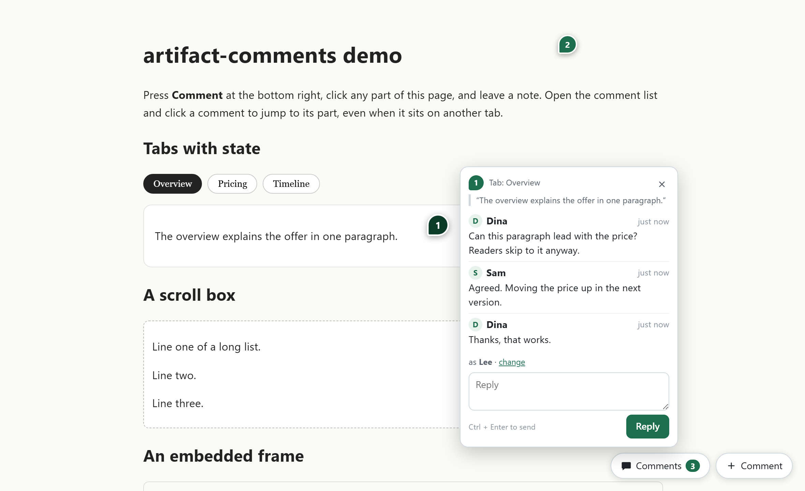
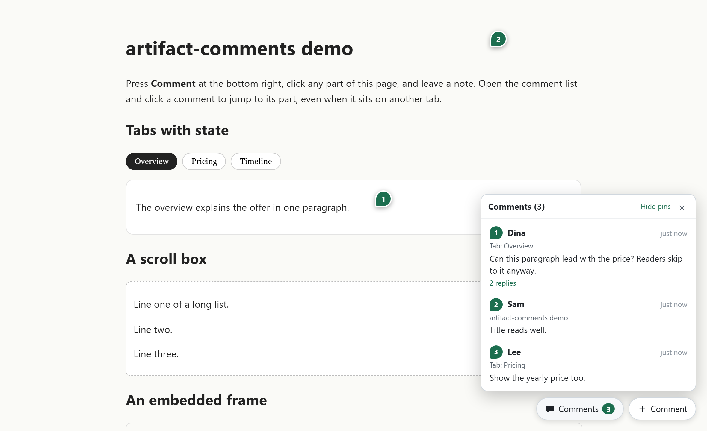
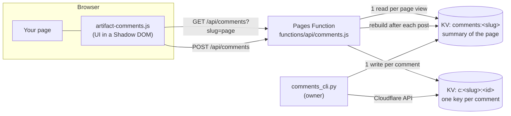

# artifact-comments

Figma-style comments for any static HTML page. A reader clicks **Comment**, clicks any part of the page, types a name and a comment. A numbered pin appears on that exact spot for everyone who opens the page. Anyone can open the thread and reply.

No accounts, no build step, no framework. One script tag on the page, and one small backend: a Cloudflare Pages Function on Workers KV, or a single-file Node server on SQLite that you host yourself. It is made for the pages you share for review: explainers, mockups, clickable prototypes, slide decks, reports.



## What readers get

- **Comment on a part.** Press Comment, point at any element (the element under the cursor is outlined), click, write. The page does not react to that click, so a button in a prototype does not fire while you point at it.
- **Pins on the exact spot.** Each thread is a numbered pin at the point that was clicked, not just the element. Pins follow the page when it scrolls, animates or resizes, and hide when their part is not on screen.
- **Threads and replies.** Click a pin to open the thread. Reply at the bottom. Replies are one level deep, as in Figma.
- **A list that jumps.** The Comments button lists every thread with who, when, where and the reply count. Click one and the page goes to that part, even when it sits on another tab, slide or screen. It scrolls to it, flashes it and opens the thread.
- **Names without accounts.** A reader types a name once. The browser remembers it.
- **Nothing lost.** A comment that cannot be sent (offline, server error) stays on screen as "Not sent" with a Retry button, survives a reload, and is sent again automatically when the connection comes back. A background refresh never wipes a reply being typed.
- **Keyboard.** `Ctrl` + `Enter` (or `Cmd` + `Enter`) posts. `Esc` closes the form, then the thread, then leaves comment mode. Keys typed into a comment never reach the page, so a slide deck or player that uses the space bar or arrows does not move while someone types.
- **Hide pins** for a clean view while presenting. The choice is remembered for that page.



## How it works



1. **The client** (`client/artifact-comments.js`, no dependencies) draws everything inside a Shadow DOM attached to `<html>`. The page's CSS cannot restyle it, and it never changes the page's own DOM.
2. **An anchor** is saved with every comment: a CSS selector for the clicked element, the element's first 80 characters of text, its tag, and the click point as a fraction of the element's box. The text check stops a pin from landing on a different element that happens to match the same selector later.
3. **Page state** is saved too, when the page provides an [adapter](#pages-with-state-the-adapter): which tab, slide or screen was showing. The list uses it to bring the part back before it scrolls to it.
4. **The server** is one of two backends with the same contract (see [API](#api)):
   - `functions/api/comments.js`, a Cloudflare Pages Function. It stores each comment under its own KV key, so two people posting at the same moment can never overwrite each other. It then rebuilds a per-page summary, which is the only key a page view reads.
   - `server/node/server.mjs`, a self-hosted server for Node 22.13 or later with no npm packages. It stores comments in one SQLite file through the built-in `node:sqlite`, one transaction per post. See [Self-hosted with Node](#self-hosted-with-node).

## Quick start on Cloudflare Pages

You need a Cloudflare account and a Pages project that serves your HTML.

**1. Copy two files into the project you deploy.**

```
your-site/                        <- the directory you deploy
  artifact-comments.js            <- from client/
  my-page.html
functions/api/comments.js         <- from functions/api/, next to (not inside) your-site
```

`functions/` sits in the directory you run `wrangler pages deploy` from.

**2. Add the script to each page**, just before `</body>`:

```html
<script src="/artifact-comments.js" data-slug="my-page" defer></script>
```

`data-slug` names the page's comment list: lowercase letters, digits and dashes, up to 80 characters. Leave it out to use the file name.

**3. Create an API token** at <https://dash.cloudflare.com/profile/api-tokens>, custom token, with:

- Account > Workers KV Storage > Edit
- Account > Cloudflare Pages > Edit

**4. Create the store and connect it to the project:**

```bash
export CF_API_TOKEN=...  CF_ACCOUNT_ID=...
python scripts/comments_cli.py --namespace-title my-site-comments setup --project my-pages-project
```

This creates the KV namespace if it does not exist and binds it to the project as `COMMENTS`, for production and preview. It keeps any other KV bindings the project already has.

**5. Deploy** as usual, for example `npx wrangler pages deploy your-site --project-name my-pages-project`. Open the page. The two buttons are at the bottom right.

**Pages on another origin.** To let pages on other origins call this endpoint, set the Pages environment variable `ALLOWED_ORIGINS` to a comma-separated list of origins (for example `https://docs.example.com,https://review.example.com`), or `*` for any origin. Unset, the endpoint serves same-origin pages only.

## Self-hosted with Node

`server/node/server.mjs` serves the same API from one file. It needs Node 22.13 or later and nothing from npm.

```bash
node server/node/server.mjs --static examples      # then open http://127.0.0.1:8787/demo
```

| Flag | Default | Meaning |
| :--- | :--- | :--- |
| `--port` | `8787` (or `$PORT`) | Listen port |
| `--host` | `127.0.0.1` (or `$HOST`) | Listen address. Use `0.0.0.0` in a container |
| `--db` | `comments.db` | The SQLite file. Created on first start |
| `--static DIR` | none | Also serve a folder of pages, with clean URLs (`/demo` serves `demo.html`). `/artifact-comments.js` is served from `client/` when the folder does not have it |
| `--allow-origin O` | none | Let pages on origin `O` call the API through CORS. Repeat it, give a comma list, or `*`. `ALLOWED_ORIGINS` works too |
| `--token T` | none | Turn on the owner endpoints. `ARTIFACT_COMMENTS_TOKEN` works too |

Node prints an `ExperimentalWarning` for `node:sqlite`. `npm start` in `server/node/` passes `--no-warnings=ExperimentalWarning`.

**Docker**, built from the repository root:

```bash
docker build -f server/node/Dockerfile -t artifact-comments .
docker run -p 8787:8787 -v ac-data:/data -e ARTIFACT_COMMENTS_TOKEN=change-me artifact-comments
```

The database lives in the `/data` volume. Add `-e ALLOWED_ORIGINS=https://your.site` when the pages are served from another origin, and point each page at the server with `data-api="https://comments.your.site/api/comments"`.

**Owner endpoints**, only when a token is set, called with `Authorization: Bearer <token>`:

| Request | Does |
| :--- | :--- |
| `GET /api/comments/admin?slug=S` | `{"pages": {slug: {"comments": [...], "deleted": [...]}}}` for one page, or every page when `slug` is left out |
| `POST /api/comments/admin/delete {slug, id}` | Soft delete a comment and its replies. They stay in the file, marked deleted |
| `POST /api/comments/admin/restore {slug, id}` | Undo that delete, with the replies |

`comments_cli.py --backend node` calls these for you (see below).

## Script options

| Attribute | Default | Meaning |
| :--- | :--- | :--- |
| `data-slug` | the file name | Which comment list the page uses |
| `data-api` | `/api/comments` | The endpoint URL |
| `data-position` | `right` | `left` puts the buttons and the list at the bottom left, for pages that already use the right corner |
| `data-changelog` | the project changelog on GitHub | Where the "What's new" link in the Comments panel footer points |

The same keys (`slug`, `api`, `position`, `changelog`) can also be set on `window.ArtifactComments`. The client's version is in its `VERSION` constant, shown in the panel footer and exposed as `window.__artifactComments.version`.

## Pages with state: the adapter

A plain document needs nothing: every element is always there, and the list scrolls to it. A page that shows different content in the same place does need an adapter: tabs, a slide deck, a walkthrough that plays one screen after another, a prototype. Without an adapter the list cannot bring back a part that is on another slide, and a pin could land on the wrong slide's version of an element.

Define `window.ArtifactComments` before the script runs. Every key is optional:

```js
window.ArtifactComments = {
  // What the page is showing now. Saved with each new comment, as JSON, 600 characters at most.
  state: () => ({ slide: current }),

  // Bring a saved state back. May return a Promise.
  restore: (s) => showSlide(s.slide),

  // Is the page showing this comment's state right now? Return true, false,
  // or undefined when it cannot tell. With it, a pin shows only on its own
  // slide, and it still shows when the slide's text changed (another language).
  isCurrent: (s) => s.slide === current,

  // Last resort for comments without a usable state: show each state in turn
  // and call test() after each one. Stop and return true when test() is true.
  search: (test) => {
    for (const n of allSlides) { showSlide(n); if (test()) return true; }
    return false;
  },

  // Readable "where" for the list, e.g. "Pricing > slide 4". Gets the clicked element.
  // Return '' to fall back to the nearest heading above the element.
  label: (el) => `Slide ${current + 1}: ${titleOf(current)}`,

  // Stop autoplay or animation. Called on entering comment mode and on opening a thread.
  pause: () => player.pause(),
};
```

How the list finds a part, in order: it is already on screen; `restore(state)`; `search(test)`, first requiring the saved text to match and then without; the saved `#hash` for pages that keep state in the URL. If all of these fail, the thread still opens, with a note that the part is no longer on the page.

`examples/demo.html` is a complete working example with tabs, a scroll box and an iframe.

## Reading and moderating comments

`scripts/comments_cli.py`, Python 3.8 or later, standard library only:

```bash
# one page, through the public API, no credentials
python scripts/comments_cli.py list --base https://my-site.pages.dev --slug my-page

# every page, through the Cloudflare API
python scripts/comments_cli.py --namespace-title my-site-comments list

# remove a comment and its replies (the id is printed by list); they go to a trash
python scripts/comments_cli.py --namespace-title my-site-comments delete --slug my-page --id mg1k2x9fa3

# undo that delete
python scripts/comments_cli.py --namespace-title my-site-comments restore --slug my-page --id mg1k2x9fa3

# rebuild page summaries from the per-comment keys
python scripts/comments_cli.py --namespace-title my-site-comments repair
```

Credentials come from `--creds file.json` (`{"api_token", "account_id", "kv_namespace_id"}`) or from `CF_API_TOKEN`, `CF_ACCOUNT_ID` and `CF_KV_NAMESPACE_ID`.

On the self-hosted Node server, add `--backend node` with the server URL and its owner token. `list`, `delete` and `restore` then go through the owner endpoints:

```bash
python scripts/comments_cli.py --backend node --base http://127.0.0.1:8787 --token "$ARTIFACT_COMMENTS_TOKEN" list
python scripts/comments_cli.py --backend node --base http://127.0.0.1:8787 --token "$ARTIFACT_COMMENTS_TOKEN" delete --slug my-page --id mg1k2x9fa3
python scripts/comments_cli.py --backend node --base http://127.0.0.1:8787 --token "$ARTIFACT_COMMENTS_TOKEN" restore --slug my-page --id mg1k2x9fa3
```

`repair` and `setup` manage Workers KV, so they are Cloudflare only and refuse on `--backend node`. Flags that belong to the other backend (`--creds` on node, `--token` on Cloudflare) are refused rather than ignored.

## API

`GET /api/comments?slug=<slug>` returns `{"comments": [...]}`, oldest first.

`POST /api/comments` with a JSON body returns `{"comment": {...}}`, the stored record.

| Field | Rules |
| :--- | :--- |
| `slug` | Required. `^[a-z0-9][a-z0-9-]{0,79}$` |
| `name` | Required, 60 characters at most |
| `text` | Required, 1,000 characters at most, line breaks kept |
| `parent` | Optional. The id of the comment this replies to. A reply to a reply joins the top comment's thread |
| `where` | Optional, 200 characters. Readable place, shown in the list |
| `anchor` | Optional, top-level comments only. `{sel, text, tag, fx, fy}`, where `fx` and `fy` are 0 to 1 |
| `state` | Optional, top-level comments only. Any JSON object up to 600 characters |

The server sets `id` and `at` (ISO time). Errors: `400` for invalid input, `413` for a body over 8 KB (8,192 bytes of UTF-8, not characters), `429` once a page holds 1,000 comments (on Cloudflare a soft cap: posts arriving in the same instant can pass it by a few; on Node it is exact).

`OPTIONS /api/comments` answers a CORS preflight from an allowed origin (`ALLOWED_ORIGINS` on Cloudflare, `--allow-origin` on Node) with `Access-Control-Allow-Origin`, `-Methods: GET, POST, OPTIONS` and `-Headers: content-type`. Any other origin gets no CORS headers.

Both backends implement this contract with the same validation code. `functions/api/comments.js` stays a single self-contained file, because publishers copy it on its own.

## Storage and cost

On Node, everything is one `comments` table in the SQLite file: one row per comment, with the stored record and a `deleted_at` mark set by the owner. The rest of this section is about Cloudflare.

Workers KV keys, all in one namespace:

| Key | Holds |
| :--- | :--- |
| `c:<slug>:<id>` | One comment. Written once, never changed |
| `comments:<slug>` | Every comment of the page, the only key a page view reads |
| `deleted:<slug>` | Ids removed by the owner, so a rebuild never restores them |
| `trash:<slug>:<id>` | A deleted comment, kept so `restore` can undo the delete |

Per page view: 1 KV read, and 1 more every 30 seconds while the tab is visible. Per comment: 2 writes and 2 key listings. The free Workers plan allows 100,000 reads and 1,000 writes and listings a day, which is roughly 500 comments a day across all pages.

KV is eventually consistent. A comment can take up to about 60 seconds to reach a reader in another region. The person who posted it sees it at once, because the client keeps its own posts until the server returns them.

## Security and limits

- **No login.** Anyone who can open the page can comment and give any name. The pages are meant to be unlisted review links. Do not use this for anything that needs identity.
- **Moderation** is owner-only, through the CLI. There is no delete or edit button in the page.
- **Text only.** All comment content is rendered as text, never as HTML.
- Caps: 1,000 comments per page, 8 KB per request, the field limits above.
- **The keyboard shield has one gap.** A page listener registered on `window` in the capture phase before this script loads still sees the keys. That setup is rare.
- Browsers: current Chrome, Edge, Firefox and Safari, on desktop and mobile. It needs Shadow DOM and `fetch`.

## Testing

```bash
pip install playwright && python -m playwright install chromium
python tests/e2e_test.py                  # Cloudflare function, on wrangler pages dev
python tests/e2e_test.py --backend node   # the same suite on the Node server
python tests/e2e_test.py --backend both
```

`--backend wrangler` (the default) starts `wrangler pages dev` with a fresh local KV; `--backend node` starts `server/node/server.mjs` on a fresh SQLite file. Either way the suite drives the demo page in Chromium. The core 65 checks cover picking, pins, threads, replies, the list jump across tabs, scroll boxes, iframes, clicks and keys that must not reach the page, a second reader, offline and failed posts, markup in comments, a phone-sized screen, records from the first version, and 12 simultaneous posts. On top of those: the panel footer version, a page on another origin posting through CORS, preflight and origin checks, the byte-accurate size limit, and `comments_cli.py list` through the public API (72 checks). The Node run adds the owner CLI round trip, post, list, delete and restore, with a wrong token and `repair` refused (78 checks). Nothing touches your Cloudflare account.

## Files

```
client/artifact-comments.js      the browser script
functions/api/comments.js        the Cloudflare Pages Function
server/node/server.mjs           the self-hosted Node server (plus package.json, Dockerfile)
scripts/comments_cli.py          list, delete, restore, repair, setup
examples/demo.html               a page with an adapter
tests/e2e_test.py                end-to-end tests, on either backend
docs/                            screenshots
CHANGELOG.md                     what changed in each version
LICENSE, NOTICE                  Apache-2.0
SKILL.md                         instructions for Claude Code
```

## Changelog and license

See [CHANGELOG.md](CHANGELOG.md). Licensed under the Apache License 2.0, see [LICENSE](LICENSE).
