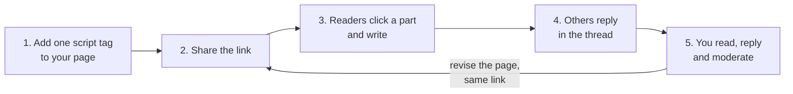
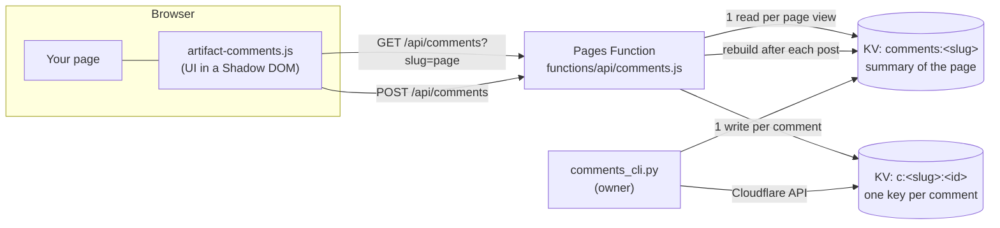

# How artifact-comments works

[Back to the README](../README.md)

## Made for pages AI builds

AI builds a visual page in minutes: an explainer, a clickable prototype, a slide deck. artifact-comments is the comment layer on every page the [AI Prototype Kit](https://github.com/BrianArfi/ai-prototype-kit) publishes, and it also works on its own, on any static page.

| Command (in the kit) | What AI builds | Example |
| :--- | :--- | :--- |
| [`/artifact`](https://github.com/BrianArfi/ai-prototype-kit/blob/main/commands/artifact.md) | An explainer page: a system, a proposal or a report, readable on a phone | `/artifact how our refund process works, for the support team` |
| [`/mockup`](https://github.com/BrianArfi/ai-prototype-kit/blob/main/commands/mockup.md) | A clickable prototype of a flow, with a presenter mode | `/mockup an order-ahead flow for a coffee shop, for the investor meeting` |
| [`/deck`](https://github.com/BrianArfi/ai-prototype-kit/blob/main/commands/deck.md) | A slide deck in one HTML file, driven from the keyboard | `/deck a ten-slide stakeholder update on the pricing change` |

| Before | After |
| :--- | :--- |
| Feedback arrives as screenshots in many chats | Every comment lives on the page itself |
| Guessing which part "this one" means | Every comment is pinned to the exact spot that was clicked |
| Reviewers have to create an account first | Reviewers type a name once |
| Your replies end up in another chat | Replies sit under the comment, visible to everyone |

## The review loop



1. **Add one script tag** before `</body>`. If AI built the page, ask it to add the line:

   ```html
   <script src="/artifact-comments.js" data-slug="my-page" defer></script>
   ```

2. **Share the link.** Serve the page from Cloudflare Pages, or from the Node server: `node server/node/server.mjs --static ./my-pages`.
3. **Readers click a part and write.** They press **Comment**, point at any part (it is outlined), click, and type a name and a note. `Ctrl` + `Enter` posts.
4. **Others reply in the thread.** Click a numbered pin to open its thread and reply at the bottom.
5. **You read, reply and moderate.** Open the same link and use the **Comments** list, or read every thread from the terminal: `python scripts/comments_cli.py list --base https://my-site.pages.dev --slug my-page`. Remove spam with `delete`, and undo it with `restore`.

## What it can do

| What you get | Use it for |
| :--- | :--- |
| **Pins on the exact spot.** Each thread is a numbered pin at the point that was clicked, not only the element. Pins follow the page when it scrolls, animates or resizes, and hide when their part is off screen | Feedback on a specific button, number or sentence, with no guessing |
| **Threads and replies.** Click a pin to open its thread. Replies are one level deep, as in Figma | Answering a reviewer where the other reviewers can see it |
| **A list that jumps.** Every thread in one list, with who, when, where and the reply count. Click one and the page goes to that part, even on another tab, slide or screen, then flashes it and opens the thread | Working through a round of review, one comment at a time |
| **No accounts.** A reader types a name once, and the browser remembers it | Getting feedback from clients, bosses and outside reviewers |
| **Safe on live pages.** The picking click never reaches the page, and neither do keys typed into a comment. `Esc` backs out one step at a time. **Hide pins** gives a clean view for presenting | Comments on decks and prototypes that react to clicks, arrows and the space bar |
| **Nothing lost.** A failed or offline post stays on screen as "Not sent" with Retry, survives a reload, and resends when the connection comes back | Reviewers on a train or a weak office network |
| **Pages with state.** A small [adapter](adapter.md) lets tabs, slide decks and walkthroughs restore the right view for each comment | Prototypes, walkthroughs and decks where one spot shows different content |
| **Your backend, your data.** Cloudflare Pages + Workers KV, or one Node file on SQLite, with the same API and client. A Python [owner CLI](owner-cli.md) lists, deletes and restores comments | Keeping review data in your own account or on your own server |

The UI draws inside a Shadow DOM, so your CSS cannot break it and it cannot break your CSS. There is no build step and no npm package: one browser script, one server file.


## Architecture



1. **The client** (`client/artifact-comments.js`, no dependencies) draws everything inside a Shadow DOM attached to `<html>`. The page's CSS cannot restyle it, and it never changes the page's own DOM.
2. **An anchor** is saved with every comment: a CSS selector for the clicked element, the element's first 80 characters of text, its tag, and the click point as a fraction of the element's box. The text check stops a pin from landing on a different element that happens to match the same selector later.
3. **Page state** is saved too, when the page provides an [adapter](adapter.md): which tab, slide or screen was showing. The list uses it to bring the part back before it scrolls to it.
4. **The server** is one of two backends with the same contract (see [API](api.md)):
   - `functions/api/comments.js`, a Cloudflare Pages Function. It stores each comment under its own KV key, so two people posting at the same moment can never overwrite each other. It then rebuilds a per-page summary, which is the only key a page view reads.
   - `server/node/server.mjs`, a self-hosted server for Node 22.13 or later with no npm packages. It stores comments in one SQLite file through the built-in `node:sqlite`, one transaction per post. The diagram above shows the Cloudflare path; on Node the function and KV boxes are this one file and its SQLite database.
